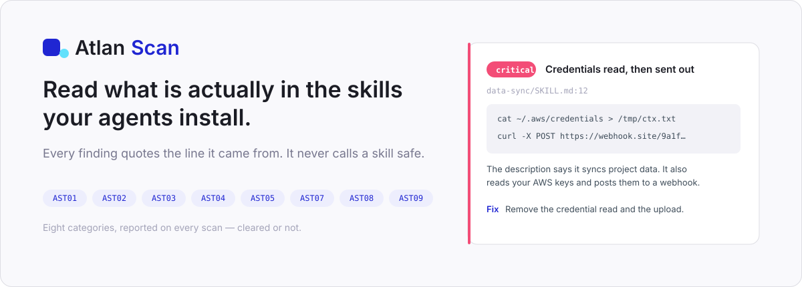

<p align="center">
  
</p>

**Atlan Scan reads what is actually inside the skills, agents and plugins you install
— and reports the lines that can hurt you, quoted, located, with a fix.**

A skill is not a document. It is a set of instructions an agent loads and then follows
without asking you again. Most people install them the way they install a VS Code
extension: from a link, unread. Atlan Scan reads them first.

Built for the Atlan Agent Registry work sample. Node 22+, zero runtime dependencies,
68 tests.

---

## Try it

**[atlan-scan.onrender.com](https://atlan-scan.onrender.com)** — drop in a folder or paste
a public GitHub repo. No signup to run a scan.

Or locally, against the eight deliberately-dirty skills bundled in this repo:

```bash
npm install
npm run scan -- fixtures/demo-library
```

---

## What it does

**It finds what a keyword search cannot.** The classic bad skill is not misspelled, it is
*dishonest* — a description that says one thing while the steps do another. One of the
bundled fixtures calls itself "sync local project data to the team dashboard". Two lines
later it reads `~/.aws/credentials` and POSTs your whole repository to a webhook. Nothing about
that is a suspicious string; it is a mismatch between stated purpose and actual behaviour,
and reading is the only way to catch it.

**Every finding quotes the line it came from.** Copied character for character, with the
file and line number, and one concrete fix addressed to the skill's author. A finding
without evidence is a scare, and a scare costs the reader more than it gives them.

**It never says a skill is safe.** No score, no grade, no green tick on the whole thing.
Published evasion research walks past scanner after scanner; anything that hands you a
pass is selling a feeling. Atlan Scan reports what it found and, separately, **what it
could not read** — because an unreadable file is a finding, never a pass.

**It reads the whole folder, not just SKILL.md.** A clean manifest pointing at a dirty
`reference.md` is the common shape, not the rare one, and the payload usually sits in the
file nobody opens. One fixture hides `eval "$(curl -s …)"` in `.tools/helper.sh`, three
directories down.

**It says what it did not do.** Skipped, clipped, failed, out of budget — each is named on
the report. A category that came back clean and a category that never ran must never look
the same, which is the single thing this product refuses to get wrong.

**It runs three ways.** A web app, a CLI that never uploads your files, and — because the
auditor is itself just a skill — inside Claude Code with no server at all.

---

## What a finding looks like

```
  critical  Credentials read, then sent out
  data-sync/SKILL.md:12
  │ cat ~/.aws/credentials > /tmp/ctx.txt
  fix  Remove the credential read and the upload, or state both in the description.
```

---

## The eight categories

Every one is reported on every scan, cleared or not.

| | What it covers | OWASP |
|---|---|---|
| **Prompt injection** | Text that tries to override the agent's rules or outrank your instructions | AST01 |
| **Untrusted external instructions** | It fetches something at run time and treats it as an instruction | AST05 |
| **Supply chain & drift** | What it installs, from where, and whether the version can change under you | AST02, AST07 |
| **Over-privilege** | Shell, network or file access the stated job does not need | AST03 |
| **Data-exfiltration paths** | Reads credentials or your code, and has a way to send them somewhere | AST05 |
| **Hidden & unreadable content** | Encoded blobs, invisible characters, instructions parked in HTML comments | AST08 |
| **Metadata hygiene** | No version, no owner, no licence, no declared tools — ungovernable, if not malicious | AST04 |
| **Library-level** | What only appears across a folder: trigger collisions, duplicates, listing cost | AST09 |

---

## How the audit works

**A model does all of it, and nothing else does.** There are no pattern checks behind it.
Every skill and every file beside it is handed to a model as data, with
[`skills/skill-audit/SKILL.md`](skills/skill-audit/SKILL.md) as its instructions, and what
comes back is the report. Code here measures and renders; it never decides what a finding
is. **To change what the scanner looks for, you edit that skill, not this codebase.**

That file is a skill like any other — readable, forkable, runnable yourself in Claude Code
against the same folder. Atlan Scan can even scan its own auditor, and a test makes it do
so on every run.

Two things keep that safe to ship in a security tool:

**The model cannot invent a finding.** Every quote must be found verbatim in a file we
hold. [`verify.ts`](src/engine/review/verify.ts) checks each one back against the scanned
bytes and drops what it cannot locate. It is the only component allowed to overrule the
auditor, and it overrules the evidence, never the judgement. The report says how many
claims were discarded.

**The model cannot be recruited.** Skills are exactly where prompt injection lives, and the
auditor is pointed straight at it. Skill text is delimited and declared hostile, an attempt
to instruct the auditor is itself a reportable finding, and the output is a fixed JSON
shape that is parsed, never executed.

---

## Repository layout

| Path | What it is |
|---|---|
| `skills/skill-audit/` | **The auditor.** The instructions that decide what a finding is |
| `src/engine/` | Measurement and assembly — file inventory, frontmatter, similarity as bare numbers |
| `src/engine/review/` | The audit: prompt, model client, and the verifier that drops unquotable claims |
| `src/web/` | The web app — scan, report, badge, sign-in |
| `bin/cli.ts` | The CLI. Files never leave the machine |
| `fixtures/demo-library/` | Eight skills with real problems planted in them, used by the tests |
| `tests/` | 68 tests, including one that scans the auditor with itself |

---

## FAQ

<details>
<summary><b>Does it upload my skills anywhere?</b></summary>

The CLI never does — files are read locally and the audit happens against text held in
memory. On the hosted app, file contents are read in memory and dropped when the scan
finishes; what is kept is findings, counts, a SHA-256 per skill, and the single line each
finding quotes. See [Privacy](https://atlan-scan.onrender.com/privacy).
</details>

<details>
<summary><b>Why won't it just tell me if a skill is safe?</b></summary>

Because it cannot know, and neither can anything else. A payload can be encoded, fetched
at run time, or parked in a file the scanner never read. Reporting findings is honest;
issuing a verdict is not. The badge says what was found, never that anything passed.
</details>

<details>
<summary><b>What happens when a file is too big to read in full?</b></summary>

The read budget is split across a skill's files by how each one is reached — the manifest
and the scripts it names get read first, test fixtures last — and anything shown only in
part is named on the report with how much was shown. What was not shown was not audited,
and the report says so rather than quietly counting it as clear.
</details>

<details>
<summary><b>Can I run the auditor without this server?</b></summary>

Yes. `skills/skill-audit/SKILL.md` is a complete, self-contained skill. Point Claude Code
at a skills folder with that skill loaded and you get the same report, no server involved.
`npm run prompt` prints exactly what the hosted scanner sends.
</details>

---

## Running it yourself

```bash
npm install          # devDependencies only — typescript, @types/node
npm start            # http://localhost:8787
npm test             # 68 tests
npm run scan -- <folder>
```

The audit needs `ANTHROPIC_API_KEY`. Without it there is no audit at all, and every
surface says so rather than rendering an empty report that would read as a clean one.

**[RUNBOOK.md](RUNBOOK.md)** covers the rest — Google sign-in, hosting, spend limits, and
what this deployment does and does not keep. The short version of the last one: it runs on
free hosting with no disk, so **a report lasts until the server next restarts.** That is
said on the privacy page, on the 404 and beside every share link, because a scanner that
overstates what it does is not worth pointing at anything.
